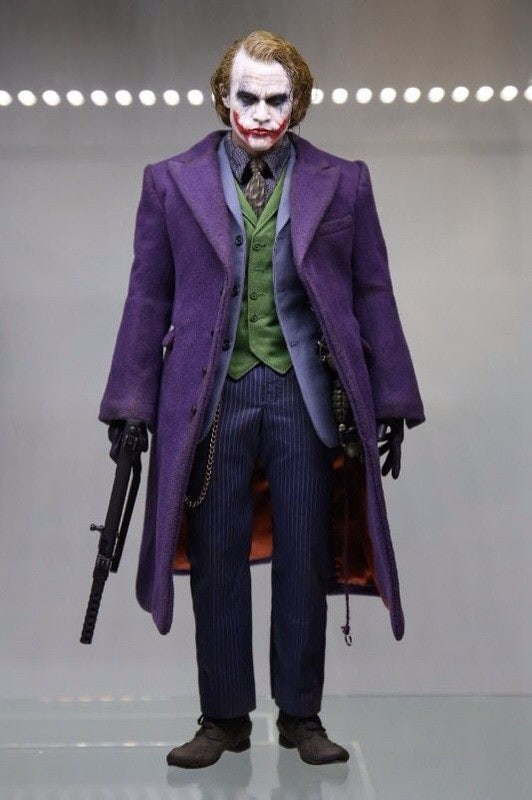
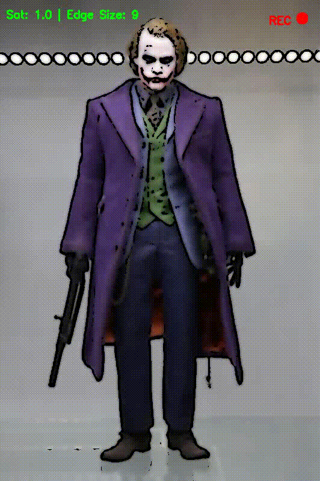
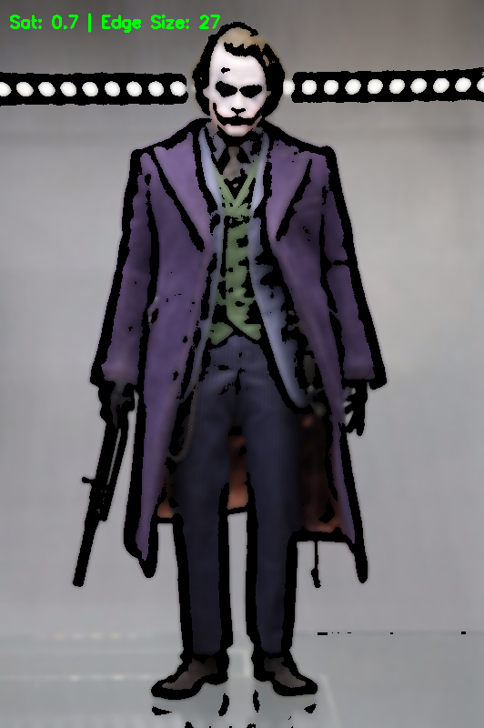
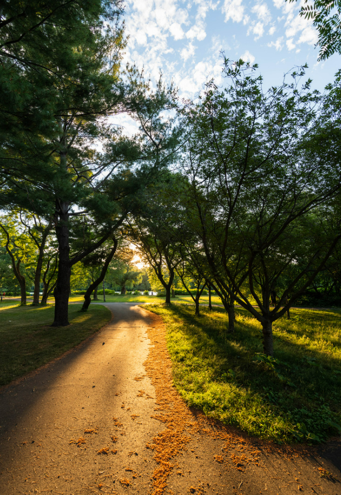
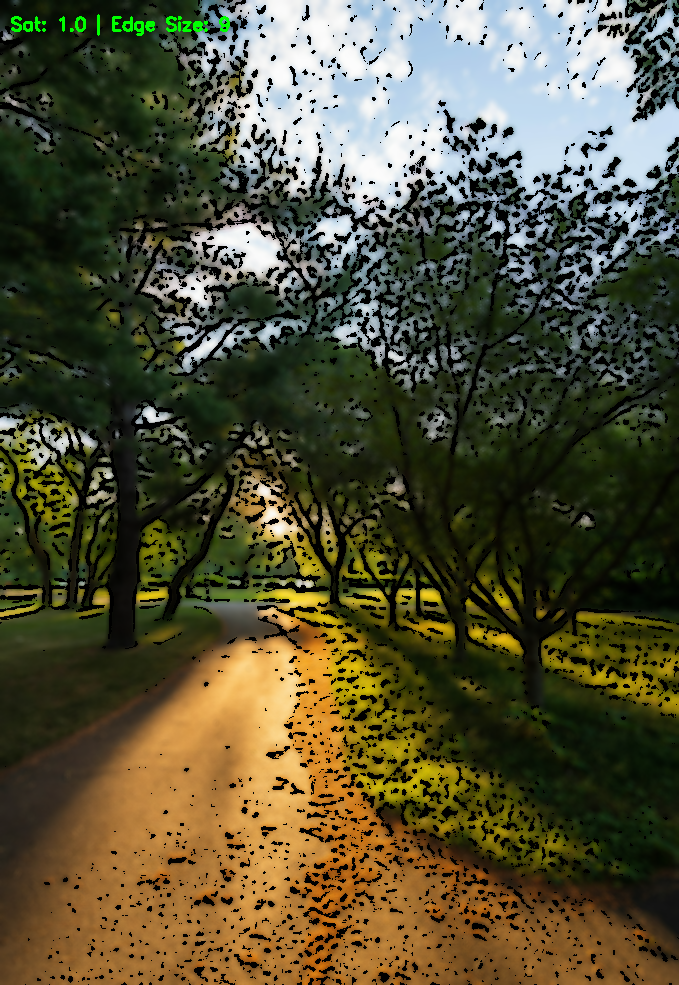

# Interactive Cartoon Renderer with Real-time Recording

This project is an advanced image transformation tool that converts standard photographs into **Toon-shaded (Cartoon-style)** art using OpenCV. It features real-time interactive controls for artistic effects and a built-in screen recording function.

---

## Control Guide

| Key | Function | Description |
| :--- | :--- | :--- |
| **Space** | **Record Start/Stop** | Toggles real-time video recording (Saves as `output.mp4`). |
| **C / D** | Saturation Up/Down | Increases or decreases color intensity. |
| **↑ / ↓** | Edge Size Up/Down | Adjusts the thickness of the outlines (Block Size). |
| **ESC** | Save & Exit | Saves the final image as `[filename]_result.png` and exits. |

---

## Showcase: Successful vs. Failed Cases

### Successful Case: Character Portrait (Joker)
*Highly effective due to high contrast, clear boundaries, and smooth gradients.*

| Original Image | Interactive Process (Demo) | Final Result |
| :---: | :---: | :---: |
|  |  |  |

---

### Failed Case: Complex Nature (Foliage)
*Challenges arise with intricate textures and low contrast, leading to significant edge noise.*

| Original Image | Interactive Process (Demo) | Final Result |
| :---: | :---: | :---: |
|  |  |  |

## Technical Analysis & Limitations

Based on the showcase above, the following technical insights were gathered:

1. **Optimal Input (Joker)**: The algorithm works best on images with distinct subjects and high local contrast, where the `Adaptive Threshold` can easily define outlines.
2. **Noise in Complex Textures (Nature)**: In areas like foliage (leaves, grass), the `Adaptive Threshold` perceives minor intensity changes as edges, resulting in excessive "salt-and-pepper" noise.
3. **Input Latency**: Due to the heavy computational cost of `cv2.bilateralFilter()`, there is a noticeable delay in key input processing for high-resolution images.

---

##  Future Roadmap

* **GPU Acceleration (CUDA)**: To reduce input latency by offloading image processing to the GPU.
* **Morphological Cleaning**: Using **Erosion/Dilation** to remove the "salt-and-pepper" noise found in the nature scene.
* **Image Pyramid**: To optimize processing speed by downscaling during interactive adjustment.
